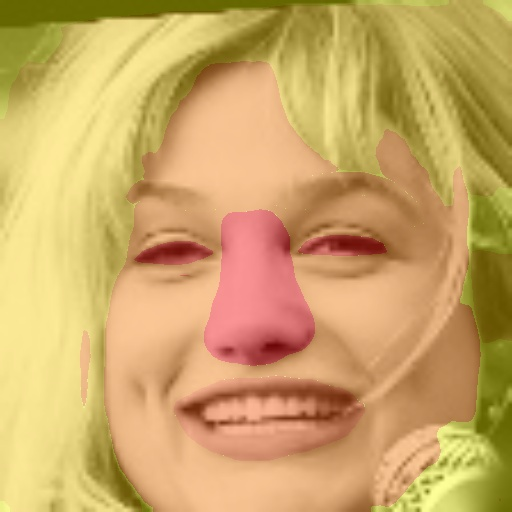

## 1. Environment

```shell
conda install pytorch-lightning -c conda-forge
```

## 2. conduct experiment

```shell
python main.py 
    --dataset-root ../VGGFace2/Img \
    --data-list ../VGGFace2/label.txt \
    --num-classes 8631 \
    --pre-trained ../VGGFace2/pretrained/CosFace-r50-8631.pth \
    --cls-device cuda:2 \
    --seg-device cuda:3 \
    --save-dir results/VGGFace2-CosFace
```

## 3. results

| image | Grad-CAM | Part Score | Edge |
| - | - | - | - |
|  |  |  |  |

## 4. Tips

### 4.1 Fase parser

```python
from face_parser import FaceParser, remove, read_img

model = FaceParser(num_classes=9, model_path="FaceParser.ckpt")

model.eval()

image = read_img("train_align_arcface/n000002/0002_01.jpg")

# 'background', 'mouth', 'eyebrows', 'eyes', 'hair', 'nose', 'skin', 'ears', 'belowface'
parsed_face = model(image)
print(parsed_face.shape)

image_ = parsed_face.cpu().numpy()[0]# * 255

mouth = image_[1]   # 与上面顺序一致

eyes = image_[2]
```

### 4.2 ArcFace

```python
import torch
import torchvision.transforms as transforms
from PIL import Image

transforms = transforms.Compose([
            transforms.Resize((112,112)),
            transforms.ToTensor(),
            transforms.Normalize((0.5,0.5,0.5),(0.5,0.5,0.5))
        ])

def Path_Image_Preprocessing(image_path):
    data = Image.open(image_path)
    data = transforms(data)
    data = torch.unsqueeze(data,0)
    return data

# 预测图像

weight_path = os.path.join("ckpt/ArcFace-8631.pth")

recognition_net = torch.load(weight_path)
if torch.cuda.is_available():
    recognition_net.cuda()
recognition_net.eval()

image = Path_Image_Preprocessing("n000002/0002_01.jpg")

ID_logit = model(image.cuda())
_, predicted = torch.max(ID_logit, 1)
```